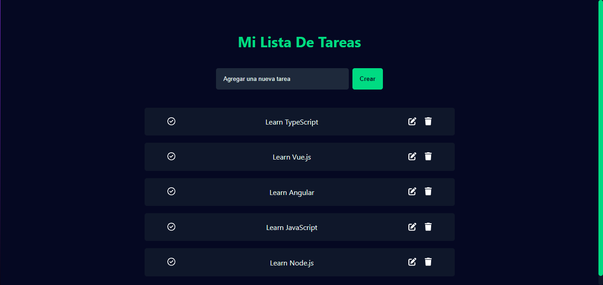

# Aplicación de Tareas con Vue.js

Se ha creado esta aplicación de tareas con el propósito de practicar y mejorar mis habilidades en el desarrollo de aplicaciones con Vue.js y TypeScript. He utilizado la `Composition API`, haciendo uso del `script setup` en toda la aplicación. Además, integré la biblioteca `Vue 3 Toastify` para mostrar notificaciones al agregar una nueva tarea o ante cualquier error, y también empleé la biblioteca de iconos `Fort Awesome` para incluir iconos en la interfaz de usuario.


### Clonar e instalar las Dependencias:
```cmd
git clone https://github.com/ErickSiguache/Task-List-in-Vue
npm install
```

### Creacion del proyecto

Comandos usados para la creación del proyecto:

```cmd
Ruta > npm create vue@latest

✔ Project name: … task-list-in-vue
✔ Add TypeScript? … Yes
✔ Add ESLint for code quality? … Yes
✔ Add Prettier for code formatting? … Yes

Ruta > cd task-list-in-vue

task-list-in-vue > npm install
task-list-in-vue > npm run dev
```

### Dependencias usadas en el proyecto:

* vue3-toastify: Utilizado para generar notificaciones para el usuario.
    * https://vue3-toastify.js-bridge.com/get-started/installation.html

```cmd
npm install --save vue3-toastify
```

* fortawesome: Empleado para incorporar íconos a la aplicación.
    * https://fontawesome.com/docs/web/use-with/vue/

```cmd
npm i --save @fortawesome/fontawesome-svg-core
npm i --save @fortawesome/vue-fontawesome@latest-3
npm i --save @fortawesome/free-solid-svg-icons
npm i --save @fortawesome/free-regular-svg-icons
```

### Vista de la aplicación en pantalla completa

<p align="center">
    
</p>

### Vista de la aplicación en móviles

<p align="center">
    
</p>